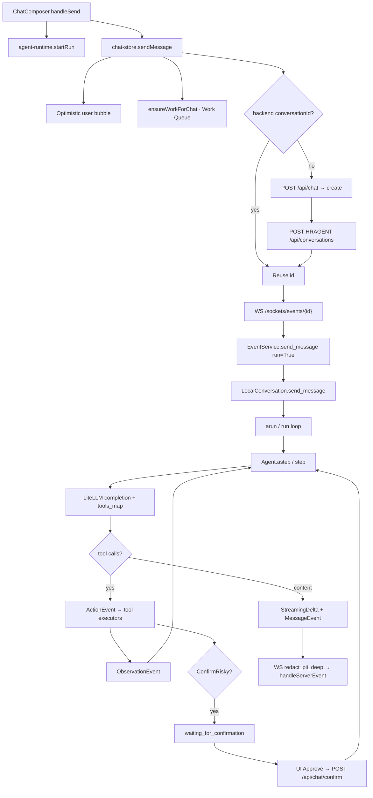
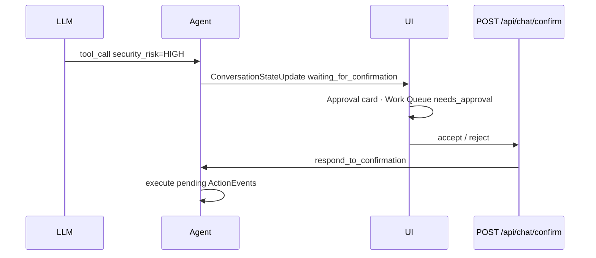

# AI Workflow Architecture — Vera / ClosedAI

**Product:** Vera HR (AI HR Copilot)  
**Scope:** End-to-end chat turn: UI → BFF → WebSocket → `LocalConversation` → Agent → tools → streamed events  
**Related:** [System](./SYSTEM-ARCHITECTURE.md) · [MCP](./MCP-ARCHITECTURE.md) · [Skills](./SKILLS-ARCHITECTURE.md)

---

## 1. Executive summary

ClosedAI’s production chat path is:

> **Next.js secret broker + browser WebSocket** → **HRAgent `LocalConversation` agent loop**  
> with **eager HR MCP**, **lazy marketplace MCP**, **HITL ConfirmRisky**, **skill progressive disclosure**, and **dual-layer PII redaction**.

The agent loop is classic **ReAct**: LLM → `ActionEvent` → tool → `ObservationEvent` → repeat until `FINISHED` or confirmation pause.

---

## 2. End-to-end message flow



### Stage table

| Stage | Path | What happens |
|-------|------|--------------|
| UI composer | `chat_interface/components/chat-composer.tsx` | `startRun` then `sendMessage`; blocks while running or approval pending |
| Client store | `chat_interface/lib/chat-store.ts` | Optimistic UI, Work Queue mirror, WS send `{ role, content: [{ type:'text', text }] }` |
| Conversation create | `chat_interface/app/api/chat/route.ts` | Browser `POST /api/chat` → Next proxies create with LLM keys, HR persona, `mcp_config.hr`, `client_tools`, ConfirmRisky |
| WebSocket | `HRAgent_Main/runtime/server/sockets.py` | Validates message; `event_service.send_message(message, True)`; outbound PII-redacted |
| Event service | `HRAgent_Main/runtime/server/event_service.py` | Bridges to `LocalConversation`; prefers `arun()` |
| Conversation | `HRAgent_Main/core/conversation/impl/local_conversation.py` | MessageEvent, agent ready, iteration loop, stuck detector, confirmation pause |
| Agent | `HRAgent_Main/core/agent/agent.py` | Prepare messages → LiteLLM → tool calls or content |
| UI consume | `chat-store.ts` `handleServerEvent` | Bubbles, activity feed, approvals, Work Queue status |

> **Note:** `openhands-client.ts` is a legacy JSON round-trip helper. Live Copilot is **WebSocket-first**.

---

## 3. Conversation create payload (BFF)

File: `chat_interface/app/api/chat/route.ts`

On first message (empty body create), Next builds a start payload that typically includes:

| Field | Purpose |
|-------|---------|
| `agent.kind` | `'Agent'` (not ACP by default) |
| `agent.llm` | Provider/model/keys from `LLM_PROVIDER` env (never sent to browser) |
| `system_message_suffix` | Large `HR_SYSTEM_SUFFIX` (HR persona, mandatory `invoke_skill`, Cosmos rules, HITL policy) |
| `mcp_config` | **Eager `hr` only** via `buildMcpConfig()` — marketplace not merged here |
| `client_tools` | From `lib/hr-actions.ts` (email / Slack / Teams) |
| ConfirmRisky / security analyzer | HIGH-risk actions pause for approval |
| `load_user_skills` | From `LOAD_USER_SKILLS` (default **false**) |
| Optional canvas webhooks | `CANVAS_WEBHOOKS_ENABLED` (often off locally) |

### LLM provider matrix

| `LLM_PROVIDER` | Routing |
|----------------|---------|
| `tokenrouter` (default) | `openai/<model>` + `TOKENROUTER_*` |
| `azure` | `azure/<deployment>` + `AZURE_OPENAI_*` |
| `openai` | bare model + `OPENAI_API_KEY` |
| `groq` | `groq/<model>` |
| `ollama` | `ollama_chat/<model>` |
| `gemini` | `gemini/<model>` |

Tunables: `HR_LLM_TEMPERATURE`, `HR_LLM_MAX_OUTPUT_TOKENS`, `HR_LLM_REASONING_EFFORT`, `HR_LLM_STREAM`.

Backend LLM: LiteLLM via `HRAgent_Main/models/llm/llm.py`.

---

## 4. Core classes

### 4.1 `LocalConversation`

`HRAgent_Main/core/conversation/impl/local_conversation.py`

- Factory via `core/conversation/conversation.py` for local workspace.
- Lazy init `_ensure_agent_ready()`: plugins → MCP merge → `agent._initialize` → eager MCP tools → `init_state`.
- `send_message`: user `MessageEvent` (+ optional knowledge-skill suffix).
- `run` / `arun`: iteration loop, stuck detector, confirmation pause, budget/max iterations, `agent.step` / `astep`.

### 4.2 `Agent`

`HRAgent_Main/core/agent/agent.py`

- `step` / `astep`: pending confirmed actions first → prepare LLM view → completion → `_handle_tool_calls` | content | empty.
- Confirmation: `_requires_user_confirmation` + `ConfirmRisky` + `LLMSecurityAnalyzer` → `WAITING_FOR_CONFIRMATION`.
- `tools_map` on `AgentBase` (`core/agent/base.py`): snapshot of `_tools` after init.

Also: `ACPAgent` for ACP subprocess agents — **not** the default chat path.

### 4.3 Tool registry

`HRAgent_Main/tools/registry.py`

- `register_tool` / `resolve_tool`
- Defaults: `tools/defaults.py` (`terminal`, `file_editor`, `task_tracker`; browser/subagents gated)
- Auto-attached builtins: `InvokeSkillTool`, `ActivateIntegrationTool`

### 4.4 Client tools

| Spec source | `chat_interface/lib/hr-actions.ts` |
| Executor | `HRAgent_Main/tools/client_tool.py` |

| Tool | Behavior |
|------|----------|
| `list_emails` | Server executes Gmail REST immediately (LOW) |
| `send_email` | After HITL approval → `send_gmail_message_sync` (HIGH) |
| `send_slack_message` / `send_teams_message` | Ack: dispatched to client |

Registered at conversation construct via `register_client_tools(...)`.

---

## 5. Skills during a chat turn

Two paths (full detail in [Skills Architecture](./SKILLS-ARCHITECTURE.md)):

**A. Proactive `invoke_skill` (primary)**  
- Tool: `HRAgent_Main/tools/builtins/invoke_skill.py`  
- HR system prompt **requires** `invoke_skill` first when topic matches `<available_skills>`  
- Executor returns full skill body as observation  

**B. Keyword / knowledge triggers (passive)**  
- `AgentContext.get_user_message_suffix` matches triggers  
- Injected as `MessageEvent.extended_content` + `activated_skills`  
- UI: `pushActivatedSkillSteps` on user MessageEvent  

---

## 6. MCP during a chat turn

Full detail in [MCP Architecture](./MCP-ARCHITECTURE.md). Short path:

```
POST /conversations mcp_config.hr (stdio → hr_mcp/server.py)
  + ambient installed plugins (.mcp.json) merged on first ready
  → eager connect only non-lazy servers (typically hr)
  → MCP tools → agent.tools_map
  → LLM tool_call → ActionEvent → MCPToolExecutor.call_tool
  → ObservationEvent
```

Lazy marketplace servers enter only after `activate_integration(name)`.

---

## 7. HITL (human-in-the-loop)



Confirm route: `chat_interface/app/api/chat/confirm/route.ts` → backend `/events/respond_to_confirmation`.

Typical HIGH actions: Cosmos upserts, `send_email`, destructive writes.

---

## 8. WebSocket event types

Defined under `HRAgent_Main/core/execution/event/`.

| `kind` | Role | UI handling (`chat-store`) |
|--------|------|----------------------------|
| Inbound user `Message` | Client → server | Triggers `send_message(..., run=True)` |
| `MessageEvent` | User echo / agent final text | Assistant bubble; user → skill activation UI |
| `StreamingDeltaEvent` | Token stream (not persisted) | Incremental bubble |
| `ActionEvent` | Tool call proposed/started | Activity step; `invoke_skill` special-cased |
| `ObservationEvent` | Tool result | Close activity; file path harvest |
| `UserRejectObservation` | User rejected confirmation | Activity warn |
| `ConversationStateUpdateEvent` | running / waiting_for_confirmation / finished / error / stuck / paused | Approvals + turn finish |
| `ConversationErrorEvent` | Fatal conversation error | System message |
| `AgentErrorEvent` | Per-tool / agent error | Activity + system |
| `ServerErrorEvent` | Socket/handler error | System + stop |
| `SystemPromptEvent` | System prompt into history | Backend |
| Condensation family | Context compression | Backend loop |
| `InterruptEvent` / `PauseEvent` | Cancel / pause | Terminal-ish via status |
| Token / LLM log / Hook / ACP events | Telemetry / ACP | Mostly unused by chat UI |

Auth control frame: `{ type: "auth", session_api_key }` (optional).  
Bash channel: separate `/sockets/bash-events` (not main chat).

---

## 9. PII redaction

| Layer | Path |
|-------|------|
| Server WS egress | `HRAgent_Main/utilities/pii_redact.py` via `sockets.py` `_send_event` |
| Browser display | `chat_interface/lib/pii-redact.ts` in chat-store, work-repo, alerts, canvas |

Patterns include: SSN, email, phone, DOB, passport, bank, CC (Luhn), IP.

---

## 10. Work queue bridge (product, not agent core)

| Mechanism | Path |
|-----------|------|
| Live chat → work item | `chat_interface/lib/chat-work-bridge.ts` — `ensureWorkForChat` on each send |
| Status updates | `setChatWorkStatus` / `noteChatApproval` |
| Separate intake ingest | `app/api/tasks/ingest` + `lib/intake-ingest.ts` (email tickets / visa expiry — not the agent loop) |

Chat work item: `externalRef = "Chat · {chatId}"`, steps Understand → Gather → Execute → Confirm.

---

## 11. Typical “help me onboard” sequence

```
[User] "help me onboard Joseph Johnson starting Monday"
  ├─ startRun → panel executing
  ├─ sendMessage
  │     ├─ optimistic Message
  │     ├─ ensureWorkForChat → Work Queue running
  │     └─ ensureSocket
  │           ├─ POST /api/chat {} (if needed)
  │           │     agent + llm + HR_SYSTEM_SUFFIX
  │           │     mcp_config.hr, client_tools, ConfirmRisky
  │           └─ WS /sockets/events/{id}
  │
[Server] LocalConversation.arun → Agent.astep
  ├─ invoke_skill(name="hr-onboarding")     Action → Observation
  ├─ employee_lookup / query_cosmos         MCP hr or cosmos after activate
  ├─ upsert_document(... HIGH)              → waiting_for_confirmation
  │     → Approve → confirm API → execute
  ├─ office_fill_* document tools           → workspace outputs
  ├─ send_email(... HIGH)                   → second HITL → Gmail send
  ├─ StreamingDeltaEvent(s)
  └─ MessageEvent(agent) + StateUpdate(finished)
        → Work Queue completed · canvas mirror
```

Onboarding policy lives in `HR_SYSTEM_SUFFIX` (create employee via `upsert_document` before paperwork; never invent records).

---

## 12. Key file index

| Concern | Path |
|---------|------|
| Composer | `chat_interface/components/chat-composer.tsx` |
| Chat state / WS | `chat_interface/lib/chat-store.ts` |
| Run panel | `chat_interface/lib/agent-runtime.tsx` |
| Create / interrupt API | `chat_interface/app/api/chat/route.ts` |
| Confirm API | `chat_interface/app/api/chat/confirm/route.ts` |
| Client tool specs | `chat_interface/lib/hr-actions.ts` |
| Work bridge | `chat_interface/lib/chat-work-bridge.ts` |
| WS server | `HRAgent_Main/runtime/server/sockets.py` |
| Event service | `HRAgent_Main/runtime/server/event_service.py` |
| LocalConversation | `HRAgent_Main/core/conversation/impl/local_conversation.py` |
| Agent loop | `HRAgent_Main/core/agent/agent.py` |
| Tool registry | `HRAgent_Main/tools/registry.py` |
| Client tools | `HRAgent_Main/tools/client_tool.py` |
| Skills tool | `HRAgent_Main/tools/builtins/invoke_skill.py` |
| Activate MCP | `HRAgent_Main/tools/builtins/activate_integration.py` |
| MCP executor | `HRAgent_Main/mcp_integration/tool.py` |
| Gmail delivery | `HRAgent_Main/mcp_integration/gmail_delivery.py` |
| Events package | `HRAgent_Main/core/execution/event/` |
| PII (server) | `HRAgent_Main/utilities/pii_redact.py` |
| PII (client) | `chat_interface/lib/pii-redact.ts` |

---

## 13. Design invariants

1. **Create once, stream always** — REST create is not the turn transport.
2. **ReAct until done or confirm** — empty/content responses finish; HIGH tools pause.
3. **Skills guide HOW; tools supply facts** — never stop after `invoke_skill` with only a plan when data tools are needed.
4. **Work Queue mirrors chat** — product observability, not agent memory.
5. **PII is redacted on the wire and again in the UI** — defense in depth for demos/logs.

---

*Generated from codebase analysis of the ClosedAI working tree.*
