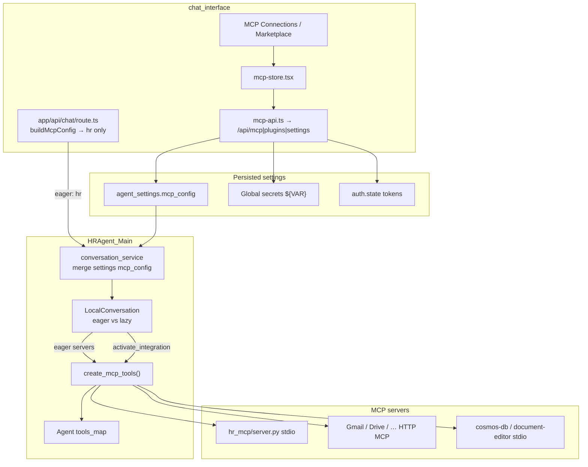

# MCP Architecture — Vera / ClosedAI

**Product:** Vera HR (AI HR Copilot)  
**Scope:** Model Context Protocol servers, UI, credentials, and how tools reach the agent  
**Related:** [System](./SYSTEM-ARCHITECTURE.md) · [AI Workflow](./AI-WORKFLOW-ARCHITECTURE.md) · [Skills](./SKILLS-ARCHITECTURE.md)

---

## 1. Executive summary

MCP in ClosedAI is a **three-layer** system:

1. **`hr_mcp`** — local FastMCP stdio server for HR read tools; injected as eager server key **`hr`** from the chat create route.
2. **`mcp_integration` + conversation runtime** — materializes configured servers into agent tools; marketplace servers are usually **lazy** until `activate_integration`.
3. **`chat_interface` MCP UI** — discovers, installs, probes, and persists configs/OAuth into `settings.mcp_config`. It does **not** itself put tools on the live agent.

**Critical split**

| UI “MCP Connections” | Agent runtime |
|----------------------|---------------|
| Setup complete + last probe health | Tools registered after connect |
| Persist secrets / OAuth | Eager vs lazy activation rules |

> Installing Gmail and seeing it “Connected” does **not** put Gmail MCP tools in the LLM context until `activate_integration("gmail")` (or a restored prior activation).  
> Conversely, `list_emails` / `send_email` can work from the same OAuth session **without** activating Gmail MCP.

---

## 2. End-to-end data flow



---

## 3. Layer 1 — `hr_mcp` package

**Location:** `hr_mcp/`

| File | Role |
|------|------|
| `server.py` | FastMCP stdio server `hr-mcp` |
| `seed_data.py` | Offline employee/policy fixtures |
| `cosmos_backend.py` | Live Cosmos employee backend when credentials exist |

**Transport:** stdio only (`mcp.run(transport="stdio")`). Backend spawns it with venv Python; stdout is JSON-RPC (logs → stderr).

### Tools (mostly read-only)

| Tool | Purpose |
|------|---------|
| `employee_lookup` | Profile / compensation |
| `pto_balance` | PTO accrual |
| `org_chart` | Manager / peers / reports |
| `benefits_lookup` | Benefits enrollment |
| `policy_search` | Policy RAG over seed (or Azure Search later) |
| `write_workspace_file` | Write downloadable files under workspace |

Payloads may include `_canvas` hints for the Side Canvas.

### Backend selection

Driven by `HR_MCP_DATA_BACKEND` + Cosmos env:

- `seed` / `mock` without Cosmos → `MockBackend`
- Cosmos URI+key present → `CosmosBackend`
- `azure` without Azure SQL/Search → warn + seed fallback

### Injection path

**Not** via MCP Marketplace. Chat route builds eager config key `hr`:

`chat_interface/app/api/chat/route.ts` → `buildMcpConfig()` → stdio command/args/env (Cosmos + workspace).

Marketplace MCPs are **intentionally not** merged here (avoids redacted `/api/settings` secrets overriding ambient expansion).

---

## 4. Layer 2 — Runtime `mcp_integration`

**Package:** `HRAgent_Main/mcp_integration/`

| Module | Role |
|--------|------|
| `config.py` | `MCPServer`, auth models, coerce/dump/FastMCP |
| `client.py` | Sync helpers over `fastmcp.Client` |
| `utils.py` | `create_mcp_tools`, OAuth prep, multi-server |
| `tool.py` / `definition.py` | Tool schema + executor + observations |
| `gmail_delivery.py` | REST send/list using OAuth tokens from settings |
| `oauth_provider_config.py` | Deployment Google/Slack/GitHub client apps |
| `oauth_token_refresh.py` | Silent refresh |
| `exceptions.py` | `MCPError`, timeout, reauth |

### Config shape (`MCPServer`)

- Transports: `stdio` | `http` | `streamable-http` | `sse`
- Secrets: `env`, `headers`, `auth` as `SecretStr` with encrypt/redact
- Auth strategies: `none` | `api_key` | `bearer` | `basic` | `header` | `oauth2`
- `tool_permissions`: per-tool `allow` | `deny` | `ask`
- Normalization to FastMCP via `to_fastmcp_mcp_config()`

### Materialization — `create_mcp_tools()`

1. Decrypt / prepare FastMCP config  
2. Attach **RuntimeOnlyOAuth** (never opens a browser at runtime)  
3. Refresh expired OAuth tokens when possible  
4. Connect + `list_tools` → `MCPToolDefinition` / `MCPToolExecutor`  
5. Multi-server: **isolated parallel connections** (one bad server doesn’t kill others); tools often named `{server}_{tool}`  
6. Subscribe to `tools/list_changed` for progressive disclosure  

### Conversation wiring

```
chat route mcp_config (hr)
        ↓
conversation_service merges settings.mcp_config
        ↓
LocalConversation._ensure_plugins_loaded
  - explicit plugins + ambient installed plugins → merge mcp_config
  - expand ${VAR} from secret registry
  - _lazy_mcp_server_names = all − eager
        ↓
_ensure_agent_ready
  - eager: create_mcp_tools → add_runtime_tools
  - lazy: ActivateIntegrationTool catalog only
  - resume: restore activated_mcp_servers
```

### Eager vs lazy

| Source | Eager? |
|--------|--------|
| Client-requested (`request.agent.mcp_config`, e.g. `hr`) | **Yes** |
| MCP from **explicitly attached** plugins | **Yes** |
| Settings-store / ambient marketplace servers | **Lazy** → `activate_integration` |

Agent profiles can further filter via `mcp_server_refs` (`configuration/profiles/resolver.py`): `None` = all; list = allow-list.

Activation tool: `HRAgent_Main/tools/builtins/activate_integration.py`.

HTTP admin: `HRAgent_Main/runtime/server/mcp_router.py`  
OAuth token store: `runtime/server/mcp_oauth_store.py`

---

## 5. Layer 3 — Chat UI (Connections + Marketplace)

### Key files

| Path | Role |
|------|------|
| `chat_interface/lib/mcp-store.tsx` | Maps `settings.mcp_config` → connections; install/OAuth/probe |
| `chat_interface/lib/mcp-api.ts` | Proxied REST (`/api/settings`, `/api/mcp/*`, `/api/plugins/*`) |
| `components/pages/mcp/page.tsx` | MCP Connections page |
| `…/mcp-setup-dialog.tsx` | Credential / OAuth setup |
| `…/mcp-setup-form.tsx` | Dynamic setup fields |
| `…/mcp-detail.tsx` | Per-server detail |
| `components/pages/marketplace/page.tsx` | Marketplace browse/install |

### Store model

- Loads `agent_settings.mcp_config` with `X-Expose-Secrets: encrypted`
- Builds `McpConnection` (transport, auth preview, tools from last probe, setupNeeded)
- `PROTECTED_MCP_SERVER_IDS`: `azure-ai-search`, `cosmos-db`, `document-editor` — treated as builtin (cannot disconnect/uninstall from UI)
- `connected` ≈ “does not need setup”, **not** “live TCP to server”
- `health` / tool lists come from `POST /api/mcp/test` probes

### Marketplace install (`installAndProvision`)

1. `POST /api/plugins/install` (or refresh if already installed)  
2. Persist setup field values as **global secrets** (`PUT /api/settings/secrets`)  
3. Substitute `${VAR}` in `.mcp.json` templates  
4. Optional OAuth `auth.state` merge  
5. `PATCH /api/settings` with `agent_settings_diff.mcp_config`  

### Setup dialog

Schema from catalog `setup` + templates from `servers`; OAuth via `startOAuth` → browser → poll `oauthStatus` → write `auth.state` into that server’s config.

---

## 6. Marketplace integrations

**Catalog:** `HRAgent_Main/marketplaces/default.json`  
**Packs:** `HRAgent_Main/marketplaces/integrations/<name>/`

Each integration typically has `plugin.json`, `.mcp.json`, `README.md`.

Examples: **gmail**, google-drive/calendar/chat/people, github, slack, notion, jira, linear, postgres, cosmos-db, azure-ai-search, microsoft-365, document-editor.

### Gmail special-casing (reliability)

| Piece | Behavior |
|-------|----------|
| Template | Remote Streamable HTTP → `https://gmailmcp.googleapis.com/mcp/v1`, `auth.strategy=oauth2`, `provider=google` |
| Hosted MCP | Can be slow/flaky → longer activation timeout; prefer client tools for mail |
| `list_emails` / `send_email` | `tools/client_tool.py` → `gmail_delivery.py` (Gmail REST) using same OAuth session |
| Draft path | `MCPToolExecutor` may auto-send after Gmail `create_draft` in some paths |
| Outbound send | Reliable path is `send_email` + HITL, not only MCP draft tools |

Local stdio integrations (cosmos-db, document-editor) ship `server/` scripts under the integration folder and are protected in the UI.

---

## 7. Auth and credential flow

```mermaid
sequenceDiagram
  participant User
  participant UI as mcp-store / setup dialog
  participant API as mcp_router / settings
  participant File as oauth_providers.json
  participant Provider as Google/Slack/...
  participant Settings as mcp_config.auth.state

  User->>UI: Connect / fill secrets
  alt API key / bearer / env ${VAR}
    UI->>API: setSecret + patch mcp_config
    Note over Settings: Ciphertext SecretStr; ${VAR} expanded at conversation build
  else OAuth2
    UI->>API: POST /api/mcp/oauth/start
    API->>File: resolve client_id/secret by provider
    API->>Provider: authorization URL
    User->>Provider: consent
    Provider->>API: localhost callback
    API->>UI: oauth_state on job success
    UI->>API: PATCH mcp_config auth.state
  end
  Note over API: Runtime create_mcp_tools uses RuntimeOnlyOAuth<br/>missing/expired → reauth → MCP Settings
```

### Credential layers

1. **Deployment OAuth apps** — `~/.HRAgent/oauth_providers.json` (or `OH_OAUTH_PROVIDERS_CONFIG_PATH` / repo `config/oauth_providers.json`). Frontend never sees client secrets; catalog only gets `provider_configured`.
2. **User secrets** — named secrets for `${VAR}` in templates (API keys, Cosmos keys, …).
3. **Per-server auth** — encrypted in `mcp_config[server].auth`.
4. **Probe path** — `POST /api/mcp/test` decrypts via cipher; may return `oauth_state` to persist.
5. **Interactive OAuth** — only `/api/mcp/oauth/*` uses browser-capable FastMCP `OAuth`; runtime never pops a browser.
6. **Token store** — `mcp_oauth_store.py` maps FastMCP AsyncKeyValue keys onto settings `auth.state` collections.

---

## 8. UI vs runtime comparison

| Concern | MCP Connections UI | Agent runtime |
|---------|-------------------|---------------|
| Source of config | `settings.mcp_config` | Same settings **merged** with chat `hr` + ambient plugins |
| “Connected” | Setup complete | Tools registered on agent after connect |
| Tool list | Last successful **probe** | Live `list_tools` at eager connect / activate |
| Marketplace install | Writes settings + installs plugin | Ambient plugin merge + lazy activation |
| `hr` | Not a marketplace card; injected by chat route | Eager-connected every conversation |
| Protected servers | Cannot remove in UI | Still subject to lazy/eager rules once in config |
| Failure mode | Soft-fail panel if backend down | Per-server isolation; reauth message → MCP Settings |

---

## 9. Key files (absolute-ish)

**hr_mcp**

- `hr_mcp/server.py`
- `hr_mcp/cosmos_backend.py`
- `hr_mcp/seed_data.py`

**Runtime MCP**

- `HRAgent_Main/mcp_integration/` (package)
- `HRAgent_Main/runtime/server/mcp_router.py`
- `HRAgent_Main/runtime/server/mcp_oauth_store.py`
- `HRAgent_Main/core/conversation/impl/local_conversation.py`
- `HRAgent_Main/runtime/server/conversation_service.py`
- `HRAgent_Main/tools/builtins/activate_integration.py`

**UI**

- `chat_interface/lib/mcp-store.tsx`
- `chat_interface/lib/mcp-api.ts`
- `chat_interface/app/api/chat/route.ts`
- `chat_interface/components/pages/mcp/`

**Marketplace**

- `HRAgent_Main/marketplaces/default.json`
- `HRAgent_Main/marketplaces/integrations/`
- `HRAgent_Main/runtime/server/plugins_service.py`

---

## 10. Design invariants

1. **MCP is configured capability, not always-on context.**
2. **UI owns discovery/credentials/persistence; runtime owns when tools enter the agent.**
3. **`hr` is the eager exception** for every Vera chat.
4. **Marketplace integrations stay lazy** behind `activate_integration`.
5. **Gmail is dual-pathed** (hosted MCP + REST client tools) for reliability.
6. **Never merge redacted marketplace MCP from `/api/settings` into chat create** — ambient plugin expansion owns secrets/`${VAR}`.

---

*Generated from codebase analysis of the ClosedAI working tree.*
