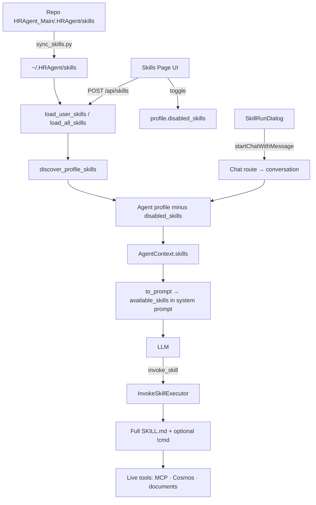
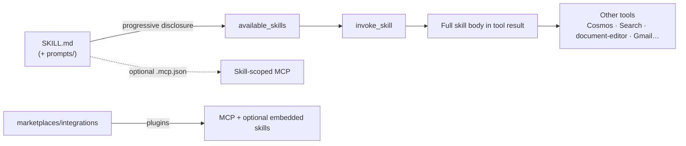

# Skills Architecture — Vera / ClosedAI

**Product:** Vera HR (AI HR Copilot)  
**Scope:** Where skills live, how they load, and how `invoke_skill` works at runtime  
**Related:** [System](./SYSTEM-ARCHITECTURE.md) · [AI Workflow](./AI-WORKFLOW-ARCHITECTURE.md) · [MCP](./MCP-ARCHITECTURE.md)

---

## 1. Executive summary

There are **three separate “skills” concepts** in this repo. Confusing them is the main source of architecture mistakes.

| Layer | Location | Audience | Runtime |
|-------|----------|----------|---------|
| **IDE / coding-agent skills** | `.claude/skills/`, `.agents/skills/` | Cursor/Claude while editing code | Host IDE agent — **not** HRAgent chat |
| **Product HR AgentSkills** | `~/.HRAgent/skills/`, `HRAgent_Main/.HRAgent/skills/` (~150 packs) | ClosedAI chat product | `invoke_skill` + progressive disclosure |
| **Marketing showcase** | `chat_interface/components/skills-showcase.tsx` | Landing page | Decorative only |

**Product skills are procedural knowledge packs**, not sandboxed microservices. Execution = load full `SKILL.md` into the model context (via tool observation), then call live tools (MCP/Cosmos/docs) for facts.

---

## 2. End-to-end product flow



---

## 3. Where skills live

### 3.1 IDE agent skills (Cursor / Claude Code)

- `.claude/skills/` — e.g. `skill-creator`, `mcp-builder`, `codebase-analysis`, …
- `.agents/skills/` — mirror for AgentSkills-compatible IDEs  
- Layout: directory with `SKILL.md` (+ optional `references/`, `scripts/`)  
- Packaging: `.claude/skills/skill-creator/scripts/package_skill.py` → `.skill` zip  

**Not loaded by HRAgent chat.** `scripts/sync_skills.py` is designed so repo `.agents/skills` do **not** pollute the HR agent catalog.

### 3.2 Product HR skills (AgentSkills format)

**Canonical repo copies**

- `HRAgent_Main/.HRAgent/skills/<name>/SKILL.md` — ~150 HR domain packs (`hr-recruiting`, `hr-payroll`, `hr-onboarding`, …)  
- Typical layout: frontmatter + body; often `prompts/`, `examples/`, `references/`

**Runtime user install path (what conversations usually see)**

- `~/.HRAgent/skills/` — synced from repo via `HRAgent_Main/scripts/sync_skills.py`
- Also searched: `~/.agents/skills/`, legacy `~/.HRAgent/microagents/`
- Installed-from-URL/git: `~/.HRAgent/skills/installed/`

**Project / workspace (lazy, workspace-aware)**

- `{work_dir}/.agents/skills/`, `{work_dir}/.HRAgent/skills/`
- Plus third-party files (`AGENTS.md`, `.cursorrules`, `claude.md`, …)

### 3.3 Public / marketplace skill repos

- Default public repo historically: `https://github.com/HRAgents/extensions` (often 404 — leftover rename)
- Cache: `~/.HRAgent/cache/skills/`
- Marketplace JSON: `HRAgent_Main/marketplaces/default.json` (primarily **MCP integrations**, not the HR skill library)

---

## 4. Product Skills page vs IDE skills vs showcase

### Product UI — Skills management

| Piece | Path |
|-------|------|
| Nav view | `chat_interface/lib/navigation.tsx` → `"skills"` |
| Shell mount | `chat_interface/components/app-shell.tsx` → `<SkillsPage />` |
| Page | `chat_interface/components/pages/skills/page.tsx` |
| Store | `chat_interface/lib/skills-store.tsx` |
| API client | `chat_interface/lib/skills-api.ts` |
| BFF proxy | `chat_interface/app/api/skills/[[...path]]/route.ts` → backend `/api/skills` |

**Behavior**

1. Loads catalog: `POST /api/skills` with `{ load_user: true, load_project: true, load_public: false }`
2. Filters to HR skills (`isHrSkill` / `hr-*`) via `skill-catalog.ts`
3. Merges enable state from **active agent profile** `disabled_skills` (deny-list)
4. Toggle enable/disable → updates profile via `/api/agent-profiles/...` (**does not** delete files)
5. **Run** opens `SkillRunDialog` → seeds a chat with `buildTryInChatPrompt()` (`Call invoke_skill("…") first…`)

Catalog metadata is **read-only** in the UI (toasts: managed from the HR skills pack).

### IDE agent skills

- Appear in Cursor’s skill picker from `.claude` / `.agents`
- Guide **this coding agent**, not the ClosedAI HR chat product
- No connection to Skills page, `disabled_skills`, or `invoke_skill`

### Showcase (marketing)

- `chat_interface/components/skills-showcase.tsx` — animated tile strip (“100+ real HR skills”)
- Hardcoded decorative tiles; **no discovery/loading/execution**

---

## 5. Discovery, load, and merge

### Backend modules

| Module | Role |
|--------|------|
| `HRAgent_Main/skills/skill.py` | `Skill` model, loaders, `to_prompt()` |
| `HRAgent_Main/skills/installed.py` | Install/enable/update under `installed/` |
| `HRAgent_Main/skills/execute.py` | `render_content_with_commands` (`!`shell``) |
| `HRAgent_Main/skills/trigger.py` | Keyword / path / task triggers |
| `HRAgent_Main/runtime/server/skills_service.py` | `load_all_skills`, `discover_profile_skills`, sync |
| `HRAgent_Main/runtime/server/skills_router.py` | HTTP API under `/skills` |
| `HRAgent_Main/configuration/profiles/resolver.py` | Apply `disabled_skills` deny-list |

### Precedence (later wins on name collision)

```
sandbox < registered marketplaces < public/sdk_base < user < org < project
```

### Formats

1. **AgentSkills** — `…/<name>/SKILL.md` → progressive disclosure (`is_agentskills_format=True`)
2. **Legacy** — flat `.md` with triggers / always-on repo context
3. **Third-party** — `AGENTS.md`, `.cursorrules`, etc.

### Profile catalog at conversation start

- `discover_profile_skills()` → user + public only (`load_project=False`, `load_org=False`)
- Wired from `conversation_service.py` / `agent_profiles_router.py`

### Chat creation knob

`chat_interface/app/api/chat/route.ts`:

```text
LOAD_USER_SKILLS  (default false)
```

When false, conversations avoid loading 100+ packs into every system prompt (latency / token cost). Opt in when you need the full catalog.

---

## 6. Progressive disclosure and execution

### Prompt surface

- Section: `HRAgent_Main/context/prompts/sections/dynamic.py` (`AvailableSkillsSection`)
- Partition: `context/agent_context.py` (`_partition_skills`)
- System prompt advertises **name + short description only** inside `<available_skills>` / `<SKILLS>`

### Mandatory policy (product)

`HR_SYSTEM_SUFFIX` in `app/api/chat/route.ts` instructs the model to:

1. Scan `<available_skills>` on every user message  
2. If any skill overlaps the topic → **`invoke_skill` first**  
3. After skill returns → immediately continue with live data tools in the **same turn**  
4. Skip only for pure small talk / clearly off-topic  

### `invoke_skill` tool

`HRAgent_Main/tools/builtins/invoke_skill.py`

- Auto-registered when catalog has AgentSkills-format skills  
- Executor loads skill by name, `render_content_with_commands`, returns full body as observation  
- UI activity: Action/Observation for `invoke_skill` → skill category steps in `chat-store.ts`

### Keyword / knowledge triggers (passive)

- `AgentContext.get_user_message_suffix` matches triggers on user text  
- Injected as `MessageEvent.extended_content` + `activated_skills`  
- Frontend safety-net for activity UI: `chat_interface/lib/skill-triggers.ts` (e.g. mirrors `hr-onboarding` keywords)

### Inline commands

Trusted `!`shell`` snippets inside skill content expand at render time via `skills/execute.py`. Skills remain **content + optional local command expansion**, not a separate runner service.

### UI “Run” path

`skill-run-dialog.tsx` does **not** execute skills itself. It starts or continues a chat with a crafted user message that tells the model to call `invoke_skill`. Real execution is always backend `InvokeSkillTool`.

---

## 7. Backend HTTP surface

`skills_router.py` (proxied as `/api/skills` from Next):

| Endpoint family | Purpose |
|-----------------|---------|
| `POST /skills` | Catalog load |
| `POST /skills/sync` | Refresh public repo cache |
| Installed CRUD | install / list / enable / disable / update / uninstall |
| `GET /skills/marketplace` | Marketplace skill catalog entries |

---

## 8. Skills ↔ MCP / tools / prompts



| Concept | Role |
|---------|------|
| **Skills** | Domain instructions (how to do HR work) |
| **Tools** | Callable actions (`invoke_skill`, MCP tools, client tools, …) |
| **Prompts** | Often under skill dirs as authoring content; chat also injects strong mandatory rules |
| **MCP** | Skills may ship `.mcp.json`; legacy frontmatter `mcp_tools`; marketplace is mainly MCP plugins that can also embed skills via `Plugin.get_all_skills()` |

Skills guide **which** tools to call; they are not a replacement for MCP.

---

## 9. Packing, marketplace, sync

| Mechanism | Role |
|-----------|------|
| `scripts/sync_skills.py` | Copy `HRAgent_Main/.HRAgent/skills/*` → `~/.HRAgent/skills/` |
| `sync_public_skills()` / `POST /skills/sync` | Git pull of public extensions into cache |
| `install_skill` / `install_skills_from_marketplace` | Clone/copy into `~/.HRAgent/skills/installed/` |
| `marketplaces/default.json` + integrations/ | Bundled **MCP** marketplace (UI Marketplace page); Skills section reuses skills store enable/activate |
| `package_skill.py` (IDE skill-creator) | Zip → `.skill` for AgentSkills distribution (IDE path, not HR runtime) |
| Agent profile `disabled_skills` | Soft “install state” without deleting packs |

**Marketplace UI:** `chat_interface/components/pages/marketplace/page.tsx` — welcome + Skills browse + MCP browse.

---

## 10. Key files

**Backend core**

- `HRAgent_Main/skills/skill.py`
- `HRAgent_Main/skills/installed.py`
- `HRAgent_Main/skills/execute.py`
- `HRAgent_Main/skills/trigger.py`
- `HRAgent_Main/tools/builtins/invoke_skill.py`
- `HRAgent_Main/runtime/server/skills_service.py`
- `HRAgent_Main/runtime/server/skills_router.py`
- `HRAgent_Main/configuration/profiles/resolver.py`
- `HRAgent_Main/scripts/sync_skills.py`
- `HRAgent_Main/context/prompts/sections/dynamic.py`

**Frontend product**

- `chat_interface/components/pages/skills/page.tsx`
- `chat_interface/components/pages/skills/skill-run-dialog.tsx`
- `chat_interface/lib/skills-store.tsx`
- `chat_interface/lib/skills-api.ts`
- `chat_interface/components/skills-showcase.tsx`
- `chat_interface/app/api/chat/route.ts`
- `chat_interface/lib/skill-triggers.ts`

**IDE skills**

- `.claude/skills/`
- `.agents/skills/`

---

## 11. Practical takeaways

1. **Product Skills page** manages HR AgentSkills + profile deny-list; **IDE skills** are a parallel authoring system for coding agents.
2. **Execution = prompt injection via `invoke_skill`**, not a custom runtime VM.
3. **`sync_skills.py`** is how the ~150 repo packs become live under `~/.HRAgent/skills/`.
4. **`LOAD_USER_SKILLS`** gates whether chat conversations load that large catalog (default off for latency).
5. **Marketplace** is primarily MCP integrations; the HR library is mostly sync-to-home + enable/disable.
6. Public GitHub skills repo may be a broken placeholder; **local/user skills are the reliable path**.

---

## 12. Design invariants

1. Never conflate `.claude` IDE skills with product `hr-*` AgentSkills.
2. Catalog in the system prompt is **metadata only**; full content requires `invoke_skill`.
3. Skills guide HOW; tools supply FACTS — do not stop after skill load with only a plan when data tools are required.
4. Enable/disable is a **profile deny-list**, not file deletion.
5. Showcase tiles are marketing, not architecture.

---

*Generated from codebase analysis of the ClosedAI working tree.*
