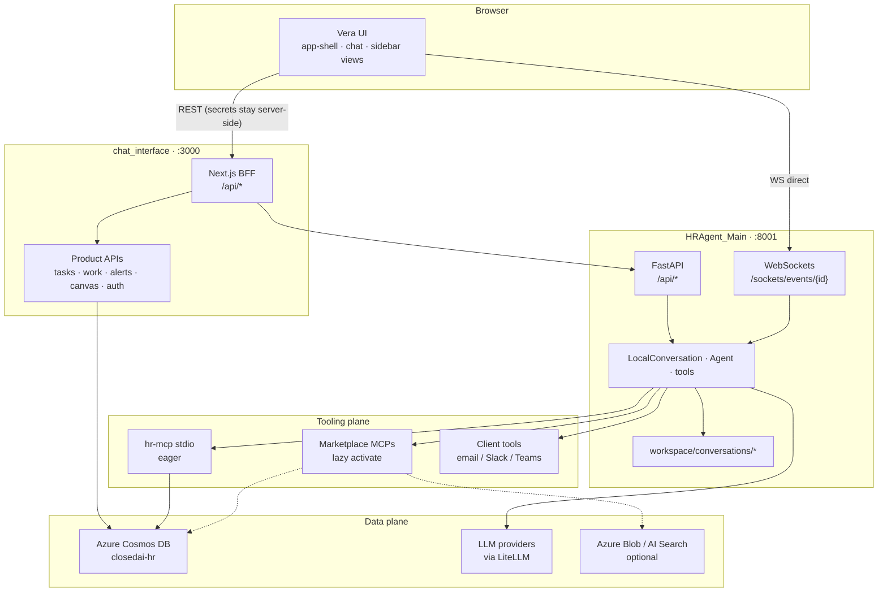

# System Architecture — Vera / ClosedAI

**Product:** Vera HR (AI HR Copilot)  
**Repo:** ClosedAI  
**Audience:** engineers, architects, demos  
**Related:** [AI Workflow](./AI-WORKFLOW-ARCHITECTURE.md) · [MCP](./MCP-ARCHITECTURE.md) · [Skills](./SKILLS-ARCHITECTURE.md) · [chat_interface MAIN](./chat_interface-MAIN.md)

---

## 1. Executive summary

Vera is a **two-process local (and Azure-deployable) stack**:

| Process | Path | Default bind | Role |
|---------|------|--------------|------|
| **UI + BFF** | `chat_interface/` | `http://localhost:3000` | Next.js App Router: product UI, secret broker, Cosmos-backed Tasks/Work/Alerts, proxies to the agent |
| **Agent runtime** | `HRAgent_Main/` | `http://127.0.0.1:8001` | FastAPI: conversations, WebSocket events, tools, skills, MCP, plugins, workspace |
| **Built-in HR MCP** | `hr_mcp/` | stdio subprocess | FastMCP server for employee/PTO/org/policy tools — **not** started by hand |

**Mental model**

> The LLM **reasons**. MCP and client tools **act**. Skills are **playbooks**. `ConfirmRisky` + Approve & Send are the **brake**. Next.js BFF keeps **secrets**. The browser WebSocket is the **live agent bus**.

---

## 2. Runtime topology



### Boot (local)

| Terminal | Command | Notes |
|----------|---------|--------|
| Backend | `HRAgent_Main\start_server.ps1` → `python -m runtime.server --port 8001` | Sets `PYTHONUTF8=1` on Windows |
| Frontend | `cd chat_interface && npm run dev` | Reads `.env.local` |

Canonical secrets for the agent load from **repo root `.env`** via `HRAgent_Main/runtime/server/env_bootstrap.py` (overrides `HRAgent_Main/.env` when present).

> **Note:** `STARTUP.md` may still mention a top-level `frontend/` directory. The **live** UI is `chat_interface/`.

---

## 3. Top-level package ownership

| Path | Owns |
|------|------|
| `chat_interface/` | Live Next.js 16 UI + BFF (chat, canvas, intake/work, MCP/skills UI, auth) |
| `HRAgent_Main/` | Flattened Python agent runtime (server, SDK packages, skills, marketplace MCP plugins, workspace) |
| `hr_mcp/` | Built-in FastMCP stdio HR tools; Cosmos or mock seed |
| `terraform/` | Azure IaC for frontend Web App (Linux App Service) |
| `docs/` | Product/architecture docs, DB redesign, audits |
| `.agents/`, `.claude/` | **IDE** coding-agent skills — not HR chat runtime |
| `.github/workflows/` | CI, Azure deploy (frontend + backend), Terraform/Checkov |

### `HRAgent_Main` internal map

| Directory | Role |
|-----------|------|
| `runtime/server/` | FastAPI entry (`api.py`, `__main__.py`), conversations, events, sockets, MCP/plugins/skills routers |
| `mcp_integration/` | MCP config, OAuth, tool materialization, Gmail REST helpers |
| `marketplaces/integrations/` | Installable MCP packs (cosmos-db, azure-ai-search, document-editor, gmail, …) |
| `skills/`, `.HRAgent/skills/` | AgentSkills library (large HR skill tree) |
| `tools/`, `context/`, `memory/`, `plugins/`, `security/`, `subagents/` | Agent SDK building blocks |
| `core/conversation/`, `core/agent/` | `LocalConversation`, `Agent` ReAct loop |
| `workspace/` | Conversation persistence + agent file workspace |
| `scripts/` | e.g. `sync_skills.py`, `populate_hr_database.py` |

---

## 4. Product surface map

Sidebar-driven SPA views (`components/app-sidebar.tsx`, `components/app-shell.tsx`):

| Surface | Nav view | Wiring | Maturity |
|---------|----------|--------|----------|
| **Chat + Side Canvas + Activity** | conversations | Full agent path (BFF create + WS) | **Core live product** |
| **Tasks (Intake)** | `intake` | `/api/tasks` → Cosmos `intake_tickets` | DB when Cosmos configured; mock fallback exists |
| **Work Queue** | `work` | `/api/work` → Cosmos `work_queue` | Same pattern |
| **HR Alerts bell** | sidebar | `GET /api/alerts` | Aggregates birthdays, work auth, urgent tickets, approvals |
| **Skills page** | `skills` | Proxies `/api/skills` | Admin chrome; runtime is `invoke_skill` |
| **MCP Connections** | `mcp` | `/api/mcp`, `/api/plugins` | Live against backend |
| **MCP Marketplace** | `marketplace` | Plugin marketplace → backend | Installs under `marketplaces/integrations/` |
| **Memory / Settings** | sidebar | Prefs / chrome | Settings real; LLM mostly env-driven |
| **Automations / Systems** | separate routes | Product vision shells | Not the live agent core |

**Operating-model story:** Intake → Work Queue → Automations around the agent.  
**Demo truth:** Chat + tools + HITL + Canvas first.

---

## 5. API surfaces

### 5.1 Next.js BFF (`chat_interface/app/api/`)

| Route | Responsibility | Downstream |
|-------|----------------|------------|
| `POST/GET/DELETE /api/chat` | Create conversation (LLM, HR prompt, hr-mcp, HITL, client_tools) | `POST {HRAGENT}/api/conversations` |
| `POST /api/chat/confirm` | HITL accept/reject | `…/events/respond_to_confirmation` |
| `/api/mcp\|skills\|plugins\|settings\|agent-profiles/[[...path]]` | Generic proxy | `{HRAGENT}/api/{prefix}…` via `lib/backend-proxy.ts` |
| `/api/canvas/state`, `/api/canvas/webhook/*` | Canvas block pipeline | Local Next ± backend webhooks |
| `/api/workspace/files`, `/upload` | Workspace files | Backend / local paths |
| `/api/tasks`, `/api/tasks/ingest` | Intake tickets | Cosmos `intake_tickets` |
| `/api/work`, `/api/work/[id]` | Work queue | Cosmos `work_queue` |
| `/api/alerts` | Aggregated HR alerts | Cosmos employees + tickets + work |
| `/api/auth/google/*` | Google OAuth | Google |
| `/api/ai-summary`, `/api/share` | Product helpers | Local / configured |

Default backend base: `HRAGENT_API_URL` → `http://127.0.0.1:8001`.

### 5.2 FastAPI (`HRAgent_Main/runtime/server/api.py`)

Mounted under `/api` (sockets outside):

| Area | Purpose |
|------|---------|
| Conversations / events | CRUD, send events, confirm, interrupt |
| MCP / plugins / skills / profiles | Tooling admin surface used by UI proxies |
| Settings / LLM / tools / hooks | Config & tooling |
| Auth / workspace | Sessions & files |
| Init / server info | Health, deferred init |
| OpenAI-compat shim | Optional |
| **WebSockets** (`sockets.py`) | `/sockets/events/{conversation_id}`, `/sockets/bash-events` |

OpenAPI (when up): `http://127.0.0.1:8001/docs`.

---

## 6. How the UI talks to the agent

Documented in detail in [AI Workflow](./AI-WORKFLOW-ARCHITECTURE.md). Short version:

1. **Composer** → `lib/chat-store.ts` `sendMessage`
2. **Once per chat:** `POST /api/chat` creates the backend conversation (LLM keys never leave the Next server)
3. **Browser WebSocket:** `NEXT_PUBLIC_HRAGENT_WS_URL` (default `ws://127.0.0.1:8001`) → `/sockets/events/{conversationId}`
4. **HITL:** waiting state → approval UI → `POST /api/chat/confirm`
5. **Canvas:** events mirrored / webhooked → Side Canvas polls `/api/canvas/state`
6. **`lib/agent-runtime.tsx`** mirrors activity into the execution panel (not the transport owner)

---

## 7. Data stores and configuration

### 7.1 Cosmos DB

Preferred database: **`closedai-hr`** (legacy references to `closedai-db` may still appear in older docs/env).

Env pattern: `COSMOS_URI` / `COSMOS_ENDPOINT` + `COSMOS_KEY`, or connection string; DB name via `COSMOS_DATABASE` / `COSMOS_DATABASE_NAME`.

| Container / surface | Role |
|---------------------|------|
| `employees` | Employee SoR; alerts; hr-mcp lookups |
| Policies container (`COSMOS_POLICIES_CONTAINER`) | Policy docs for `policy_search` |
| `intake_tickets` | App-owned Tasks / Intake |
| `work_queue` | App-owned Work Queue |
| Broader redesign (`employee_records`, `org`, …) | Target model — see `docs/database_redesign_plan.md` |

Frontend Cosmos client: `chat_interface/lib/cosmos-server.ts` (skips Fernet/`${…}` placeholders).

### 7.2 Env layers

1. **Repo root `.env`** — canonical for backend (`env_bootstrap`)
2. **`chat_interface/.env.local`** — BFF: `HRAGENT_*`, `LLM_PROVIDER`, Cosmos, OAuth, canvas flags, `LOAD_USER_SKILLS`
3. **Conversation create** — bakes LLM + `hr` MCP env into the create payload (`app/api/chat/route.ts`)

### 7.3 Auth

| Mechanism | Role |
|-----------|------|
| Google OAuth | `/api/auth/google/*` |
| Microsoft Entra (MSAL browser) | Popup SPA sign-in |
| Session API key | Optional backend gate (`X-Session-API-Key` from Next only) |
| WS auth | Optional first-message `{"type":"auth","session_api_key":…}` |
| MCP OAuth | Marketplace integrations via backend MCP OAuth routes |

Auth here is product login / integration OAuth — not a full multi-tenant API gate on every agent call.

### 7.4 Key Vault

Operational path (documented): vault **`group-1`** for Azure Foundry OpenAI secrets. Day-to-day local demos primarily use **env files**.

---

## 8. Deployment hints

| Hint | Where |
|------|--------|
| Terraform frontend App Service | `terraform/main.tf` — RG `Closed_AI`, Linux Node 20 |
| GH Actions frontend | `.github/workflows/main_closedai-yuvraj-v2.yml` — bakes `NEXT_PUBLIC_HRAGENT_WS_URL` to Azure WSS |
| GH Actions backend | `.github/workflows/main_closedai-backend.yml` — package `HRAgent_Main` → Azure |
| CI frontend build | `.github/workflows/ci-cd.yml` |
| Canvas webhook wrong port | Causes multi-minute latency — see `LATENCY-FIX-2026-08-20.md` |

---

## 9. Key entry points (checklist)

```
chat_interface/app/api/chat/route.ts          # conversation create / agent persona
chat_interface/lib/chat-store.ts              # WS orchestration + turn state
chat_interface/lib/backend-proxy.ts           # /api/{mcp,skills,…} → :8001
chat_interface/lib/agent-runtime.tsx          # execution panel
chat_interface/components/app-shell.tsx       # product surface router
HRAgent_Main/start_server.ps1                 # backend boot
HRAgent_Main/runtime/server/api.py            # FastAPI composition
HRAgent_Main/runtime/server/sockets.py        # /sockets/events/{id}
hr_mcp/server.py + cosmos_backend.py          # HR tools
docs/PRESENTATION_BRIEFING.md                 # product + architecture SoT
docs/architecture/chat_interface-MAIN.md      # frontend orchestration SoT
```

---

## 10. Design invariants

1. **Secrets never go to the browser** for LLM keys / session API key on create.
2. **WebSocket is the turn bus**; REST create is once-per-conversation (plus confirm/interrupt).
3. **`hr` MCP is eager**; marketplace MCP is lazy (`activate_integration`).
4. **Cosmos product APIs** (tasks/work/alerts) live on Next — they are not the agent loop itself.
5. **IDE skills** (`.claude/`, `.agents/`) must not be confused with product HR AgentSkills.

---

*Generated from codebase analysis of the ClosedAI working tree. Prefer evidence in the paths above over stale startup notes.*
