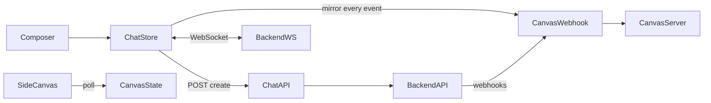

# chat_interface Architecture — MAIN (current repo)

**Source:** `ClosedAI` working tree / `main`  
**Stack:** Next.js App Router (UI + BFF) ↔ HRAgents backend (`HRAGENT_API_URL`, default `http://127.0.0.1:8001`)  
**Safety-net counterpart:** [`chat_interface-SAFETY-NET.md`](./chat_interface-SAFETY-NET.md) (`safety/eureka-pre-main-merge`)  
**Diff / restore plan:** [`chat_interface-DIFF-AND-PLAN.md`](./chat_interface-DIFF-AND-PLAN.md)

---

## 1. Directory structure (how main has it)

```
chat_interface/
├── app/
│   ├── layout.tsx, page.tsx, globals.css
│   ├── automations|workforce|systems|work/…     # secondary product routes
│   └── api/
│       ├── chat/route.ts                       # create conversation (LLM + prompt + MCP)
│       ├── chat/confirm/route.ts               # HITL confirm → backend
│       ├── canvas/
│       │   ├── state/route.ts                  # pollable generated UI blocks
│       │   └── webhook/
│       │       ├── conversations/route.ts
│       │       └── events/[conversationId]/route.ts
│       ├── mcp|skills|plugins|settings|agent-profiles/[[...path]]/
│       ├── workspace/files|upload/
│       └── ai-summary/
├── components/
│   ├── chat-area|conversation|composer|landing|approval-card
│   ├── side-canvas.tsx, ui-block-canvas.tsx    # NEW post-merge canvas UI
│   ├── agent-execution-panel, agent-activity-feed
│   ├── app-shell, app-sidebar, providers
│   ├── pages/{mcp,skills,marketplace,settings,work,workforce,…}
│   └── ui/*                                    # shadcn
├── lib/
│   ├── chat-store.ts                           # Zustand: messages + WS orchestration
│   ├── agent-runtime.tsx                       # execution-panel mirror of activity
│   ├── canvas-store.ts                         # THIN: open/width/blockCount only
│   ├── canvas-server.ts                        # NEW: LLM evaluate/generate pipeline
│   ├── canvas-types.ts, backend-proxy.ts, hr-actions.ts
│   ├── skill-triggers.ts, skills-api.ts, mcp-*
│   └── …
├── hooks/  (use-mobile, use-toast)
└── openhands-agent/  (legacy example client)
```

**Provider nesting** (`components/providers.tsx`):  
`AgentRuntimeProvider` → `ChatProvider` → `SkillsProvider` → `McpProvider` → `NavigationProvider`

---

## 2. Message → reply flow (orchestration)

```
Composer
  ├─ startRun(text)     → agent-runtime (panel UI only)
  └─ sendMessage(text)  → chat-store
        │
        ├─ POST /api/chat  (once) → Next BFF → POST {HRAGENT}/api/conversations
        │     payload: LLM env config, HR_SYSTEM_SUFFIX, mcp_config(hr),
        │              ConfirmRisky, client_tools, canvas webhooks, max_iterations=100
        │
        └─ WS  {NEXT_PUBLIC_HRAGENT_WS_URL}/sockets/events/{id}
              send user content; receive StreamingDelta / Action / Observation /
              Message / ConversationStateUpdate / errors

Every non-StreamingDelta WS event ALSO:
  POST /api/canvas/webhook/events/{id}   ← browser mirror (extra HTTP storm)

Canvas (async, post-turn-ish):
  recordCanvasEvents → LLM evaluate → LLM generate → SideCanvas polls /api/canvas/state
```

**Secrets stay on the Next server** for REST create. Browser only opens the event WebSocket.

---

## 3. Critical files and roles

| File | Role |
|------|------|
| `lib/chat-store.ts` | Single source of turn state: send, WS dispatch, streaming bubbles, activity feed, approval message injection |
| `app/api/chat/route.ts` | Bakes agent persona (`HR_SYSTEM_SUFFIX`), MCP, HITL policy, canvas webhook registration |
| `lib/agent-runtime.tsx` | Thin React context; maps `activity` → execution panel events |
| `lib/canvas-server.ts` | Server-side LLM pipeline for “UI blocks” canvas |
| `lib/canvas-store.ts` | Panel chrome only (no artifacts / openApproval) |
| `components/chat-composer.tsx` | Send/stop; **still reads `pendingApproval` / `approvalResolving`** |
| `components/chat-conversation.tsx` | Renders bubbles + inline approval cards from `message.metadata.approval` |
| `components/side-canvas.tsx` + `ui-block-canvas.tsx` | Polls generated blocks (post UI merge) |

---

## 4. State model (`useChat`)

Persisted (`localStorage` `hr-copilot:chats:v3`): conversations, messagesByChat, backendIdByChat, UI prefs.  
Ephemeral: `isRunning`, `activity`, `socket`, streaming module flags.

**Approval on main:** injected as an assistant **message** via `appendApprovalRequest` when status is `waiting_for_confirmation`. Store fields `pendingApproval` / `approvalResolving` were **removed** even though the composer still references them → send gating for HITL is broken/incomplete.

---

## 5. Agent create settings (latency-relevant)

- `HR_SYSTEM_SUFFIX`: large (~5k tokens); includes **FAST PATH** (skip `invoke_skill` for headcount/simple lookups) — main already has this vs older mandatory-skill wording.
- `load_user_skills: true`
- `max_iterations: 100`
- `confirmation_policy: ConfirmRisky` + `LLMSecurityAnalyzer`
- Canvas webhooks registered at create (`event_buffer_size: 1`, `flush_delay: 0.25`)
- Browser **additionally** mirrors nearly every WS event into canvas webhooks

---

## 6. Known MAIN pain points (why it feels slow / broken)

1. **Per-event canvas mirror** (`mirrorEventToCanvas` on almost every WS frame) → many HTTP POSTs + canvas LLM work during the turn.
2. **UI merge replaced sync tool→canvas artifacts** with an LLM block pipeline; chat orchestration lost skill-activity helpers and store-level approval flags.
3. **Composer expects `pendingApproval`** that the store no longer exposes.
4. **Waiting-for-confirmation** only looks at the last `running` activity step (safety also fell back to any recent tool step).
5. **No event-id dedupe** / **no `upsertAssistant`** → duplicate or missed assistant bubbles after reconnect/replay more likely than on safety.
6. Long system prompt + skill loading + multi-tool loops still dominate LLM latency (shared with safety; main’s FAST PATH helps if conversation was created after that change).

---

## 7. Diagram


