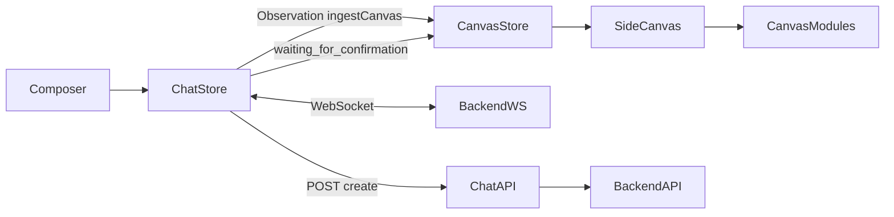

# chat_interface Architecture — SAFETY NET (working / fast)

**Source branch:** `safety/eureka-pre-main-merge` (also tip-aligned historically with `working/god-mode/eureka` at analysis time)  
**Repo:** `https://github.com/YuvrajAbrol/ClosedAI`  
**Inspect without checkout:** `git show safety/eureka-pre-main-merge:chat_interface/...`  
**Main counterpart:** [`chat_interface-MAIN.md`](./chat_interface-MAIN.md)  
**Diff / restore plan:** [`chat_interface-DIFF-AND-PLAN.md`](./chat_interface-DIFF-AND-PLAN.md)

---

## 1. Directory structure (how safety net had it)

```
chat_interface/
├── app/
│   ├── layout.tsx, page.tsx, globals.css
│   ├── automations|workforce|systems|work/…
│   └── api/
│       ├── chat/route.ts
│       ├── chat/confirm/route.ts
│       ├── mcp|skills|plugins|settings|agent-profiles/[[...path]]/
│       ├── workspace/…
│       └── ai-summary/
│       # NO app/api/canvas/* webhook LLM pipeline
├── components/
│   ├── chat-area|conversation|composer|landing|approval-card
│   ├── side-canvas.tsx
│   ├── canvas-modules.tsx          # module renderers (employee, PTO, org, …)
│   ├── agent-execution-panel, agent-activity-feed
│   ├── app-shell, app-sidebar, providers
│   └── ui/*
├── lib/
│   ├── chat-store.ts               # ~1600+ lines — full orchestration + ingestCanvas
│   ├── agent-runtime.tsx
│   ├── canvas-store.ts             # RICH: artifacts[], openArtifact, openApproval
│   ├── skill-triggers.ts
│   ├── backend-proxy.ts, hr-actions.ts
│   └── …
└── hooks/
```

**Not present on safety:** `ui-block-canvas.tsx`, `lib/canvas-server.ts`, `app/api/canvas/**`.

---

## 2. Message → reply flow (orchestration)

```
Composer
  ├─ startRun(text)
  └─ sendMessage(text)
        │
        ├─ pushActivatedSkillSteps(matchKeywordSkills(text))   # immediate UI feedback
        ├─ POST /api/chat → create backend conversation
        └─ WS /sockets/events/{id}

WS handleServerEvent:
  - seenEventIds dedupe (with special cases for skill re-paint)
  - StreamingDeltaEvent → rAF-batched bubble + “Responding…” activity
  - ActionEvent → activity step; invoke_skill gets dedicated skill UI
  - ObservationEvent → close step; on success ingestCanvas(tool, observation)
  - ConversationStateUpdateEvent:
        running | waiting_for_confirmation | terminal
  - waiting_for_confirmation →
        useCanvas.openApproval(...)  AND  pendingApproval in chat-store
  - Agent MessageEvent → upsertAssistant (replace/dedupe, not blind append)

Canvas path (sync, deterministic):
  Tool observation JSON → canvas-store.openArtifact / openApproval
  → side-canvas renders canvas-modules for that module type
  NO per-event HTTP fan-out, NO extra LLM evaluate/generate on the chat path
```

---

## 3. Critical files and roles

| File | Role |
|------|------|
| `lib/chat-store.ts` | Orchestration center: WS, streaming, skill activity, **ingestCanvas**, **pendingApproval** + approve/reject |
| `lib/canvas-store.ts` | Artifact list + approval cards bound to Side Canvas |
| `components/canvas-modules.tsx` | Deterministic HR module UIs from tool payloads |
| `app/api/chat/route.ts` | Same BFF pattern; system suffix historically **mandatory invoke_skill** (stricter than main’s FAST PATH) |
| `lib/skill-triggers.ts` | Keyword → skill names mirrored in activity panel immediately |

---

## 4. State model (`useChat` + `useCanvas`)

**chat-store extras vs main:**

- `pendingApproval: ChatApproval | null`
- `approvalResolving: boolean`
- `approvePendingApproval()` / `rejectPendingApproval()` → `POST /api/chat/confirm`
- Module flags: `seenEventIds`, richer skill helpers, `upsertAssistant`
- On Observation success: `ingestCanvas(toolName, observation)` parsing `_canvas.module` / tool-name → `useCanvas.openArtifact`

**canvas-store:**

- `artifacts: CanvasArtifact[]`, `activeId`
- `openArtifact`, `openApproval`, `resolveApproval`, `clear`
- Side Canvas flips open when an artifact/approval arrives

---

## 5. Why safety felt fast / reliable

1. **Canvas did not compete with the chat turn** — no browser POST storm, no LLM canvas pipeline on the critical path.
2. **HITL was wired end-to-end** — composer blocked on `pendingApproval`; canvas + store stayed in sync; confirm API cleared state.
3. **Skill visibility was immediate** — keyword match + `invoke_skill` activity steps; less “stuck with empty feed” confusion.
4. **Assistant text upsert/dedupe** — fewer duplicate/missing bubbles after stream finalize or WS replay.
5. **Waiting-for-confirmation fallback** — if the Action step left `running` before the status event, still found the last tool step.

Note: safety’s **prompt** still pushed mandatory `invoke_skill` for many topics (can be *slower* on LLM tool count). Perceived “fast” was often **UI responsiveness + less frontend overhead**, not always fewer backend tools. Main already softened this with FAST PATH in `route.ts`.

---

## 6. Diagram


